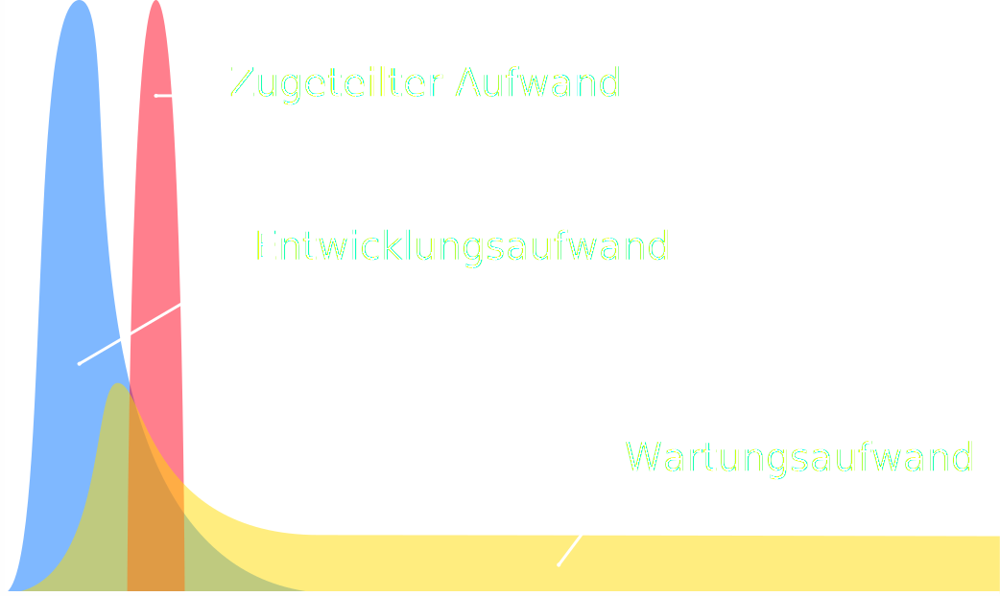
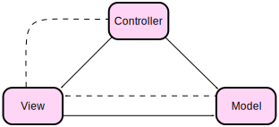
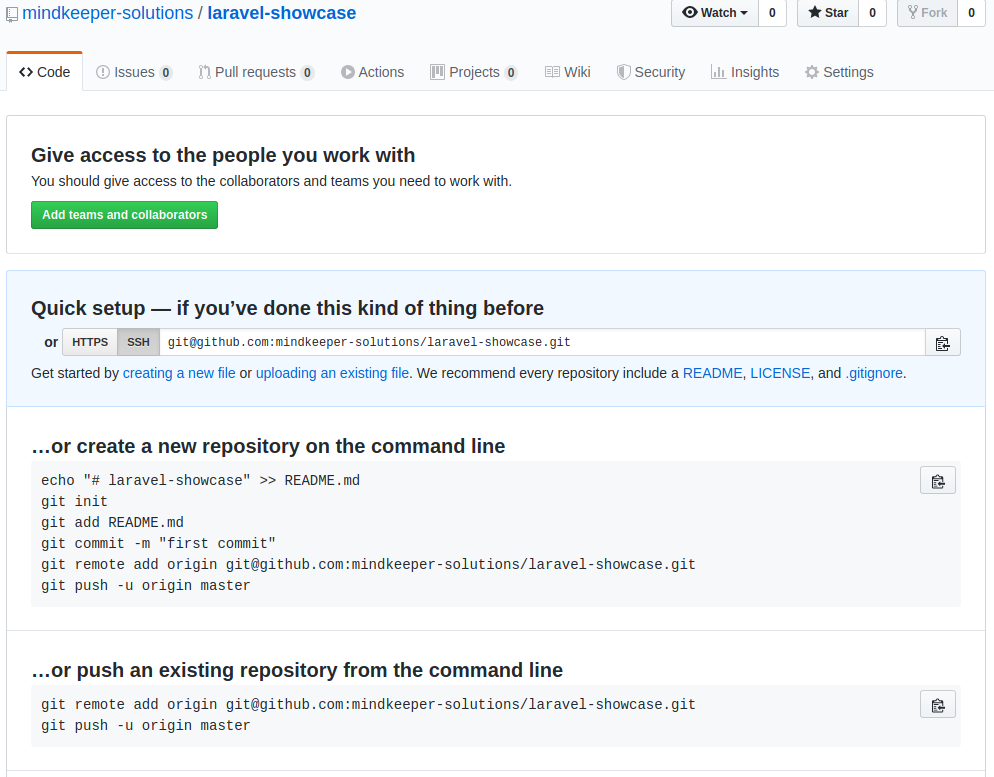
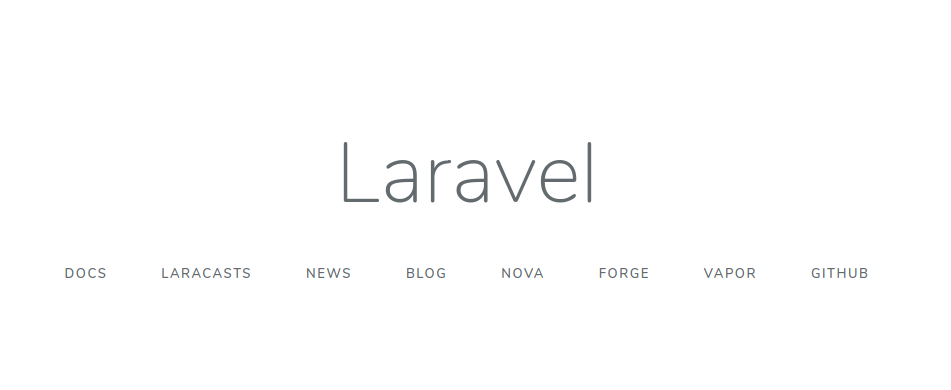
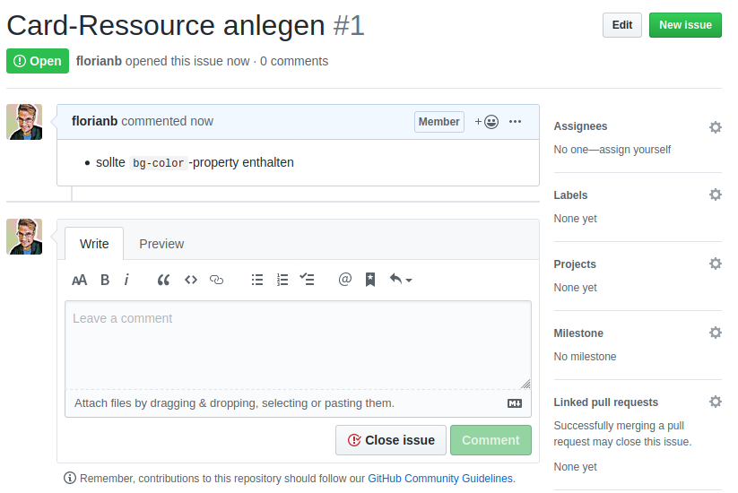

# REST & Laravel

---

## Themen

- Wozu Anwendungs-Architekturen?
- Übliche Architekuren
- Beispiel SOAP
- Beispiel REST
- Übliche REST-Architekturen
- Überblick Laravel

---

<style scoped>
h2 {
    position: absolute;
    top: 1ex;
    right: 1em;
}
</style>

## Kostenverlauf



---

## Anforderungen

- Einfachheit
- Veränderlichkeit
- Übertragbarkeit
- Wiederverwendbarkeit
- Zuverlässigkeit

---

## Einfachheit

- Einfache Bausteine sind leicht verständlich.
- Simple Architekturen vereinfachen den Blick auf den Gesamtkontext.
- Einfache Architekturen fördern Nachvollziehbarkeit und Verständlichkeit.

> Das Prinzip der Allgemeingültigkeit in modularen Systemen führt zu einheitlichen Konnektoren (Middleware)

---

## Veränderlichkeit

- **Evolvierbarkeit** - Weiterentwickeln bestehender Fähigkeiten unter gleichbleibendem Aufand.
- **Erweiterbarkeit** - Hinzufügen neuer Fähigkeiten unter gleichbleibendem Aufwand.
- **Anpassbarkeit** - Spezialisieren der Architektur für unvorhergesehene Anforderungen.
- **Konfigurierbarkeit** - Verhaltenssteuerung der Anwendung in der Bereitstellungsphase.

---

## Wiederverwendbarkeit

Mit einem hohen Maß an Wiederverwendbarkeit ermöglicht eine Architektur einzelne Komponenten und Datenelemente auch in anderen Anwendungen eiunzusetzen.

---

## Übertragbarkeit

Ein geringes Maß an Systemabhängigkeiten ermöglicht einer Architektur unter geringem Ressourceneinsatz in verschiedenen Laufzeitumgebungen betrieben zu werden.

---

## Zuverlässigkeit

Eine zuverlässige Architektur kennzeichnet sich durch ein geringes Risiko eines Systemausfalls durch den teilweisen Ausfall einzelner Systemkomponenten.

---

# Übliche Web-Service-Protokolle

- XML-RPC (1998)
- SOAP (1998)
- REST (2000)
- gRPC (2015)
- JSON-RPC (2008)

---

# SOAP

Simple Object Access Protocol

```
POST /InStock HTTP/1.1
Host: www.example.org
...
<?xml version="1.0"?>
<soap:Envelope xmlns:soap="http://www.w3.org/2003/05/soap-envelope" xmlns:m="http://www.example.org">
  <soap:Header>
  </soap:Header>
  <soap:Body>
    <m:GetStockPrice>
      <m:StockName>T</m:StockName>
    </m:GetStockPrice>
  </soap:Body>
</soap:Envelope>
```

---

# REST

Statuslos
Cachable
Vereinheitlichtes Interface (CRUDs)

- Create
- Read
- Update
- Delete
- *Search*

---

### HTTP Requests

```text
GET /card HTTP/1.1
Host: www.example.com
```

---

### HTTP Methods
| Method | Body | Safe | Idempotent | Cacheable |
|--------|------|------|------------|-----------|
| TRACE | No |Yes |Yes |Yes |No|
PUT | Yes |Yes |No |Yes |No|
POST |Yes|Yes|No |No |Yes|
PATCH |Yes |Yes|	No |No |No|
HEAD|Optional |No| Yes |Yes |Yes|
GET |Optional |Yes|Yes|Yes|Yes|
DELETE|Optional |Yes |No|Yes|No|

---

## Ruby on Rails

- REST
- Model-View-Control
- Scaffolding
- ActiveRecord ORM
- Migrations
- Convention over Configuration
- Don't Repeat Yourself

---

### MVC-Pattern


<!-- footer: "Von File:ModelViewControllerDiagram.svg: Traced by User:Stannered / *abgeleitetes Werk Davjoh - File:ModelViewControllerDiagram.svg, Gemeinfrei, https://commons.wikimedia.org/w/index.php?curid=10194593" -->

---

<!--- footer: "" -->

#### Beispiel: MVC-Implementation für Counter

```php
class CounterModel {
    public $value = 0;
    public function watch() {
        $value = $value + 1;
    }
}

class CounterController {
    public function show($id) {
        return view('counter-view', CounterModel::find($id))
    }
}

// counter-view
<div>{{ $counter->value }}</div>
```

---

## Scaffolding

Einheitliches Generieren von Projekt-Resssourcen mittels `php artisan`:

```shell
$ php artisan
Available commands:
 make
  make:command         Create a new Artisan command
  make:controller      Create a new controller class
  make:model           Create a new Eloquent model class
```

---

### Beispiel: CounterController

```shell
php artisan make:controller --resource counter
```

generiert

```php
namespace App\Http\Controllers;
use Illuminate\Http\Request;

class CounterController extends Controller {
    public function index() {...}
    public function create() {...}
```

---

## Laravel's Eloquent ORM

---

### Migrationen

```php
class CreateCountersTable extends Migration
{
    // Run the migrations.
    public function up() {
        Schema::create('counters', function (Blueprint $table) {
            $table->bigIncrements('id');
            $table->int('value');
            $table->timestamps();
        });
    }

    // Reverse the migrations.
    public function down() {
        Schema::drop('counters');
    }
}
```

---

### Fluent-Schnittstelle

```php
$counter_12 = Counter::find(12);
$counters = Counter::all();
Counter::delete(12);

$first_counter = Counter::first()
$no_of_big_counters = Counter::where('value', '>', 5)->count();

$counter = Counter::firstWhere('value', '1');
$counter->watch();
$counter->save();
```

---

## Los geht's

mit GIT, Composer & Laravel

---

### Entitäten

```shell
+----------+                 +----------+
|          |                 |          |
|   Card   +-----------------+   User   |
|          |                 |          |
+----------+                 +----------+
|          |                 |          |
| bg-color |                 | name     |
|          |                 |          |
+----------+                 +----------+
```

---

### Create GitHub Project



---

### Compose Laravel App

```shell
$ composer create-project laravel/laravel laravel-showcase
Installing laravel/laravel (v7.0.0)
...
Package manifest generated successfully.
> @php artisan key:generate --ansi
Application key set successfully.
```

---

### Project Structure

```shell
laravel-showcase
├── app
├── composer.json
├── composer.lock
├── config
├── database
├── .editorconfig
├── .env
├── .env.example
├── .gitignore
├── package.json
├── README.md
├── .styleci.yml
...
```

---

### .editorconfig

```ini
root = true

[*]
charset = utf-8
end_of_line = lf
insert_final_newline = true
indent_style = space
indent_size = 4
trim_trailing_whitespace = true

[*.md]
trim_trailing_whitespace = false

[*.{yml,yaml}]
indent_size = 2
```

---

### .gitignore

```shell
/node_modules
/public/hot
/public/storage
/storage/*.key
/vendor
.env
.env.backup
.phpunit.result.cache
Homestead.json
Homestead.yaml
npm-debug.log
yarn-error.log
```

---

### .env

```ini
APP_NAME=Laravel
APP_ENV=local
APP_KEY=base64:xMb3g0XiNlFX2VQEt2UIwNcT1OksJEk4YSqa/jTgEjg=
APP_DEBUG=true
APP_URL=http://localhost

LOG_CHANNEL=stack

DB_CONNECTION=mysql
DB_HOST=127.0.0.1
DB_PORT=3306
DB_DATABASE=laravel
DB_USERNAME=root
DB_PASSWORD=
```

---

### composer.json

```json
{
    "name": "laravel/laravel",
    "type": "project",
    "description": "The Laravel Framework.",
    "license": "MIT",
    "require": {
        "php": "^7.2.5",
        "fideloper/proxy": "^4.2",
        "fruitcake/laravel-cors": "^1.0",
        "guzzlehttp/guzzle": "^6.3",
        "laravel/framework": "^7.0",
        "laravel/tinker": "^2.0"
    },
    "require-dev": {
        "phpunit/phpunit": "^8.5",
        ...
```

---

### Entwicklerserver

```shell
php artisan serve
```

Stellt aktuellen Stand unter [localhost:8000](http://localhost:8000) bereit.



---

### Was passiert da?

```shell
❯ php artisan route:list
+--------+----------+----------+------+---------+--------------+
| Domain | Method   | URI      | Name | Action  | Middleware   |
+--------+----------+----------+------+---------+--------------+
|        | GET|HEAD | /        |      | Closure | web          |
|        | GET|HEAD | api/user |      | Closure | api,auth:api |
+--------+----------+----------+------+---------+--------------+
```

---

### `routes/web.php`

```php
<?php

use Illuminate\Support\Facades\Route;

Route::get('/', function () {
    return view('welcome');
});
```

---

### Git konfigurieren

```shell
git init
git status
git add --all
git commit -m "first commit"
git remote add origin git@github.com:mindkeeper-solutions/laravel-showcase.git
git push --set-upstream origin master
```

---

### Authentifizierung installieren

Laravels UI-Paket zu den Abhängigkeiten hinzufügen:

`composer require laravel/ui`

Dann UI für authentifizierung generieren:

```script
❯ php artisan ui bootstrap --auth
Bootstrap scaffolding installed successfully.
Please run "npm install && npm run dev" to compile your fresh scaffolding.
Authentication scaffolding generated successfully.

❯ npm i && npm run dev
```

---

### Datenbank SQLite einrichten

Datenbank-Datei anlegen:

```shell
touch database/database.sqlite
```

Datenbank-Konfiguration in `.env` vornehmen:

```ini
DB_CONNECTION=sqlite
...
DB_DATABASE=<<ABSOLUTER PFAD>>/database/database.sqlite
DB_FOREIGN_KEYS=true
```

---

### Datenbank migrieren

```shell
❯ php artisan migrate           
Migration table created successfully.
Migrating: 2014_10_12_000000_create_users_table
Migrated:  2014_10_12_000000_create_users_table (0.01 seconds)
Migrating: 2014_10_12_100000_create_password_resets_table
Migrated:  2014_10_12_100000_create_password_resets_table (0.01 seconds)
Migrating: 2019_08_19_000000_create_failed_jobs_table
Migrated:  2019_08_19_000000_create_failed_jobs_table (0.01 seconds)
```

---

### Arbeitschritt versionieren

```
❯ git status
Auf Branch master
Änderungen, die nicht zum Commit vorgemerkt sind:
        geändert:       package.json
        geändert:       resources/js/bootstrap.js
        geändert:       resources/sass/app.scss
        geändert:       routes/web.php

Unversionierte Dateien:
        app/Http/Controllers/Auth/
        ...
❯ git add --all
❯ git commit -m "Add basic authentication"
[master 27b1b8b] Add basic authentication
 25 files changed, 59021 insertions(+), 3 deletions(-)
❯ git push
```

---

### Issue basierte Branches

```shell
git branch iss1-card-resource
git checkout iss1-card-resource
```



---

### Neue Card-Resource anlegen

```shell
❯ php artisan make:model -c -m -r Card
Model created successfully.
Created Migration: 2020_03_04_161707_create_cards_table
Controller created successfully.
```

---

### Migration anpassen

```php
class CreateCardsTable extends Migration
{
    /**
     * Run the migrations.
     *
     * @return void
     */
    public function up()
    {
        Schema::create('cards', function (Blueprint $table) {
            $table->id();
            $table->timestamps();

            $table->string('bg_color', 6);
        });
    }
```

---

### Views erstellen

Wir brauchen die folgenden views:

- card/index.blade.php
- card/show.blade.php
- card/create.blade.php
- card/edit.blade.php

---

### Controller erweitern

Jede Action eines Controllers muss eine **Response** zurückgeben.

Die Response kann manuell zusammengestellt oder mittels Hilfsfunktionen erzeugt werden.

Beispiele:

- `view('card.index', ['variable' => $wert])`
- `redirect()->action('CardController@index')`

---

#### Persistierung

Eloquent erweitert unser Model um Methoden zur Interaktion mit der Datenbank.

```php
$cards = Card::all();
$card->save();
$card->delete();
```

---

### Issue 1 abschließen

Da die Ressource hinzugefügt wurde, können wir die Arbeit an dem ersten Issue abschließen.

```shell
git add --all
git commit -m 'Fix #1 by adding resource Card' 
git push --set-upstream origin iss1-card-ressource
git checkout master
git pull
git merge iss1-card-ressource
git push
```

---

### Thin Controller - Fat Models

Fügen wir dem Model eine Funktion hinzu, die eine Visitenkarte generiert und zurück gibt.

```php
public function get_svg_for_name($name) {
    return <<<SVG$
...
SVG;
}
```

---

### Benutzerdefinierte Actions

Controller können um eigene Actions erweitert werden, es kann sinnvoll sein, die Funktion in einen dedizierten Controller auszulagern.

```php
public function generate_svg(Card $card)
{
    $user = Auth::user();

    $svg_image_source = $card->get_svg_for_name($user->name);

    return response()
        ->make($svg_image_source)
        ->header('Content-Type', 'image/svg+xml')
        ->header('Content-Length', strlen($svg_image_source));
}
```

---

### Benutzerdefinierte Routen

Benutzerdefinerte Routen können genutzt werden, um die Standard-Ressource-Routen zu ergänzen.

```php
Route::get('cards/{card}.svg', 'CardController@generate_svg')
    ->name('cards.generate_svg');
```

---

### Relationen abbilden

Relationen werden durch das Anlegen von Getter-Methoden im Model und den erforderlichen Schematas eingerichtet:

```php
// app/User.php
public function cards() {
    return $this->belongsToMany('App\Card');
}
```

```php
// database/migrations/2020_03_05_153542_card_user.php
Schema::create('card_user', function (Blueprint $table) {
    $table->foreignId('card_id');
    $table->foreignId('user_id');
});
```

---

### Manipulieren der Beziehung

Die Beziehung wird über Collection-Methoden manipuliert.

```php
// app/Http/Controllers/CardController.php
public function toggle_allowance(Card $card)
{
    $user = Auth::user();
    if ($user->cards->contains($card) == true) {
                $user->cards()->detach($card);
    }
    else {
        $user->cards()->attach($card);
    }

    return redirect()->route('cards.index');
}
```

---

### Zugriff Authorisieren

Die Authorisierung erfolgt durch leichtgewichtige Gate-Methoden.

```php
// app/Providers/AuthServiceProvider.php
Gate::define('generate-svg', function ($user, $card) {
    return $user->cards->contains($card) == true;
});
```

```php
// CardController@generate_svg
if (Gate::allows('generate-svg', $card))
{ ... }
```

---

### Zugriff für restliche Routen einschränken

Das Routing lässt sich mit Route Middleware beeinflussen, die `auth`-middleware lässt das Routing nur für authentifizierte Nutzer zu:

```php
Route::get('cards/{card}.svg', 'CardController@generate_svg')
    ->name('cards.generate_svg')
    ->middleware('auth');
```
